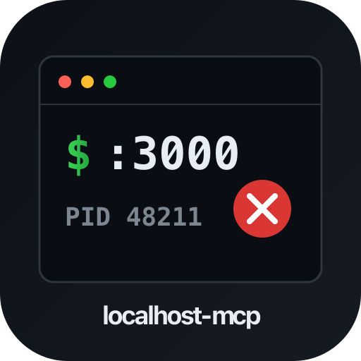
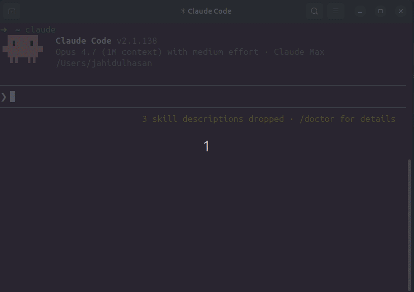

# localhost-mcp



MCP server that inspects, manages, and kills local dev servers. Stop guessing what's on `:3000`.



Pairs with [terminal-history-mcp](https://github.com/hasanjahidul/terminal-history-mcp) — together they give your AI agent full memory of your dev environment: what you ran, what's running.

## Why

Every dev hits these daily:

- `Error: listen EADDRINUSE :::3000` — what's holding the port?
- 5 forgotten `node` / `vite` / `next` PIDs from last week eating RAM
- Switching projects → no idea which dev servers still running
- `lsof -i :3000`, `kill -9 <pid>`, repeat

`localhost-mcp` makes it one tool call.

## Install

```bash
npm install -g localhost-mcp
```

Wire into Claude Code:

```bash
claude mcp add --scope user localhost -- localhost-mcp
```

Or any MCP-compatible client. The command runs as a stdio MCP server.

## Tools

| Tool | Purpose |
|------|---------|
| `list_dev_servers` | All listening dev servers w/ port, pid, framework, project, uptime, mem, cpu |
| `port_info` | Inspect single port — who holds it |
| `kill_server` | Kill by pid or port. Dry-run by default; pass `confirm=true` to execute |
| `find_zombies` | Detect long-running, idle, memory-heavy dev servers |
| `port_conflict` | Why is port X busy + 5 free alternatives nearby |

## Sample output

```json
{
  "port": 3000,
  "pid": 48211,
  "process": "node",
  "cmdline": "next dev",
  "cwd": "/Users/me/code/myapp",
  "project_name": "myapp",
  "framework": "next.js",
  "uptime_seconds": 14523,
  "memory_mb": 412,
  "cpu_pct": 0.3,
  "user": "me"
}
```

## Safety

- `kill_server` defaults to dry-run. Must pass `confirm=true`.
- Refuses to kill PIDs < 1000 (system processes).
- Refuses processes outside the dev whitelist (node, python, ruby, go, deno, bun, php, java, rails, vite, next, etc).
- SIGTERM first, escalates to SIGKILL after 5s timeout.

## Frameworks detected

next.js, vite, nuxt, remix, astro, webpack-dev-server, esbuild, create-react-app, express, fastify, koa, hono, rails, django, flask, fastapi, uvicorn, gunicorn, deno, bun, php-builtin, jekyll, hugo.

Falls back to `package.json` sniffing when the cmdline is generic (`node server.js`).

## Platform support

- macOS — full support (uses `lsof`)
- Linux — full support (uses `lsof` + `/proc`)
- Windows — basic port scan only (uses `netstat`); cwd / framework detection limited

## CLI usage

```bash
localhost-mcp list      # JSON list of all dev servers
localhost-mcp zombies   # JSON list of zombie candidates
localhost-mcp           # Start MCP stdio server
```

## Build from source

```bash
git clone https://github.com/hasanjahidul/localhost-mcp.git
cd localhost-mcp
npm install
npm run build
node dist/cli.js list
```

## License

MIT
